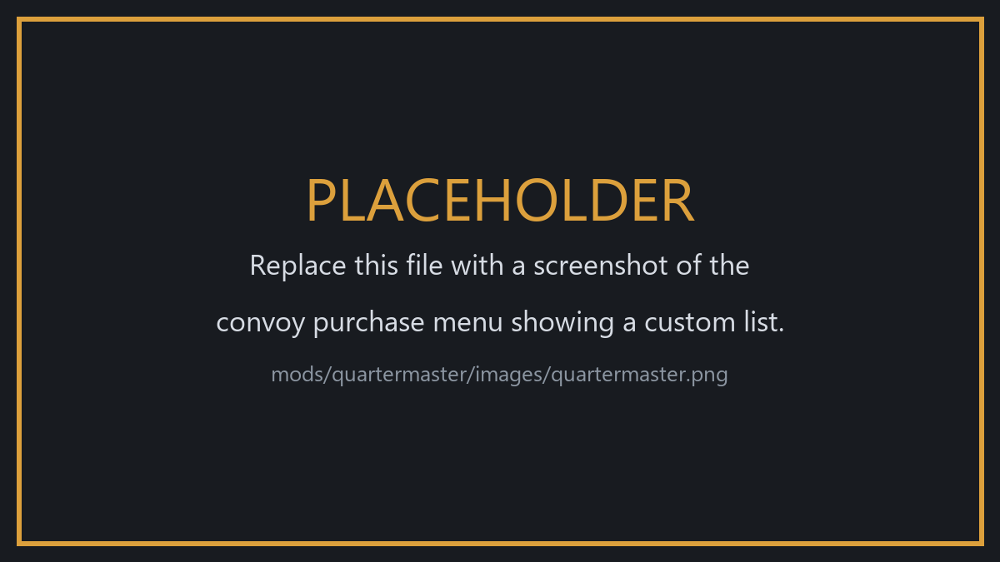

# Quartermaster

**Adds your own options to the convoy purchase menu, read from a text file you can
edit yourself.**

[](https://github.com/mosdef31/NO-Quartermaster/releases/latest)
[](https://github.com/mosdef31/NO-Quartermaster/releases)
[](https://store.steampowered.com/app/2168680/Nuclear_Option/)
[](https://github.com/mosdef31/NO-Quartermaster/issues)

📥 **[Download](https://github.com/mosdef31/NO-Quartermaster/releases/latest)** &nbsp;·&nbsp;
📝 **[What's new](./CHANGELOG.md)** &nbsp;·&nbsp;
🐛 **[Report a bug](https://github.com/mosdef31/NO-Quartermaster/issues)**

---



The mod ships with one list to try it out: a **Rocket Artillery Battery** of four
MSV MLRS launchers, two munitions trucks and two MRAPs.

## Installing

Needs BepInEx. Put the `Quartermaster` folder in `BepInEx/plugins`. The mod
writes a starter `quartermaster.json` beside its DLL the first time you run the
game.

## Editing the lists

Open `BepInEx/plugins/Quartermaster/quartermaster.json`.

```json
{
  "convoys": [
    {
      "name": "Rocket Artillery Battery",
      "cooldown": 120,
      "factions": [],
      "icon": "icons/battery.png",
      "units": [
        { "id": "Truck2-MLRS", "count": 4 },
        { "id": "Truck2-M",    "count": 2 },
        { "id": "Truck2-MRAP", "count": 2 }
      ]
    }
  ]
}
```

| Field | What it does |
|---|---|
| `name` | The text on the button. Also how the mod knows one list from another, so give each one its own |
| `cooldown` | Seconds before you can buy that option again. The game's own options use 60 |
| `factions` | Which factions get the option, by faction name. Leave it empty for all of them |
| `icon` | Optional. An image for the button, named from the mod's own folder |
| `units` | What is in the bundle |
| `id` | The unit's id, not its display name. `Truck2-MLRS`, not `MSV MLRS` |
| `count` | How many of that unit |

Only `name` and `units` are required. The price is worked out from the units
themselves, so there is nothing to set. Delete `quartermaster.json` and start the
game to get the starter file back.

**If you make a mistake in the file, the mod says which line it is on** and adds
nothing that run. Look for `Quartermaster` in `BepInEx/LogOutput.log`.

## Button icons

Put the image in the mod's own folder, or in a folder inside it, and name it from
there:

```json
"icon": "icons/battery.png"
```

- PNG and JPG both work. Any size; it is scaled to the button.
- Forward slashes are easiest. If you write backslashes, **double them** —
  `"icons\\battery.png"` — because a single one means something else in this kind
  of file.
- A full path starting with a drive letter is refused, so that a list you post
  still works for whoever downloads it.
- If the image cannot be used, the button falls back to the icon of the first
  unit in the list, and the log says why.

Leave `icon` out entirely and you get that fallback, which is usually the right
answer: it always exists and it shows what is in the bundle.

## Settings

They are in `BepInEx/config/com.quartermaster.cfg`, and you can also edit them in
Configuration Manager if you have it.

| Setting | Default | Does |
|---|---|---|
| `Enabled` | `true` | Turn the mod off without removing it. Off means nothing is added and no file is read or written |
| `Diagnostics` | `false` | Extra log lines describing what was read, what each list parsed to and what each icon loaded as |

Problems are logged whichever way `Diagnostics` is set. It only adds the
commentary around them.

## Multiplayer

**Everyone on a server uses the host's file.** Copy the host's `quartermaster.json`
into your own `BepInEx/plugins/Quartermaster` folder before you join.

Buying an option sends its **position** in the list, not its name, so a player
whose list differs from the host's would buy whatever sits in that position
instead. The mod will not let that happen: the host publishes a fingerprint of
its list, and a player whose list does not match loses the custom options for the
mission and is told why. You get the stock buy menu rather than the wrong convoy.

## What it does not do

Buying a convoy does not spawn anything that drives. It adds the units to what
your faction is allowed to field, which is what the stock convoy options do too.

## Some ids to start from

| Id | Unit |
|---|---|
| `Truck2-MLRS` | MSV MLRS |
| `HLT-MART` | HLT Mobile Artillery |
| `MBT1` | Spearhead MBT |
| `MBT` | Type-12 MBT |
| `AFV8_IFV` | AFV8 IFV |
| `AFV8_SAM` | AFV8 Mobile Air Defense |
| `Truck2-M` | MSV Munitions |
| `Truck2-MRAP` | MSV MRAP |
| `SPAAG1` | AeroSentry SPAAG |
| `RadarSAM1` | T9K41 Boltstrike |

## AI use

I use an AI agent to help with coding, refactoring, asset modification, and authoring
long bodies of text and lore.

It raises the quality ceiling beyond what my own skills currently guarantee, while I
learn and develop them. Every decision, every number, and everything that ships is mine.
